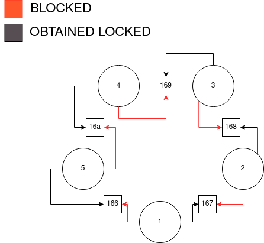

# DiningPhil

### Error trace summary

| trans \ Thread     |          0         |          1         |          2         |          3         |          4         |          5         |
|--------------------|--------------------|--------------------|--------------------|--------------------|--------------------|--------------------|
|        0-12        | create fork/ phil. instances, launch threads | |             |                    |                    |                    |
|       13-14        |                    | obtain lock 166, try to obtain lock 167 |                    |                    |                    |
|       15-16        |                    |                    | obtain lock 167, try to obtain lock 168 |                    |                    |
|       17-18        |                    |                    |                    | obtain lock 168, try to obtain lock 169 |                    |
|       19-20        |                    |                    |                    |                    | obtain lock 169, try to obtain lock 16a | |
|       21-22        |                    |                    |                    |          |         | obtain lock 16a, try to obtain lock 166 |

### Lock dependency graph



<br/>

### Patch

```java
@@ -27,18 +27,20 @@ public class DiningPhil {

     Fork left;
     Fork right;
+    boolean reversed;

-    public Philosopher(Fork left, Fork right) {
+    public Philosopher(Fork left, Fork right, boolean reversed) {
       this.left = left;
       this.right = right;
+      this.reversed = reversed;
       start();
     }

     public void run() {
       // think!
-      synchronized (left) {
-        synchronized (right) {
-          // eat!
+      synchronized (reversed ? right : left) {
+        synchronized (reversed ? left : right) {
+        // eat!
         }
       }
     }
@@ -52,7 +54,7 @@ public class DiningPhil {
       forks[i] = new Fork();
     }
     for (int i = 0; i < N; i++) {
-      new Philosopher(forks[i], forks[(i + 1) % N]);
+      new Philosopher(forks[i], forks[(i + 1) % N], i == 0);
     }
   }
 }
```

<br/>
<br/>
<br/>
<br/>
<br/>

# Bounded Queue

### Error trace: queue-do_wait

| trans \ Thread     |          0         |          1         |          2         |
|--------------------|--------------------|--------------------|--------------------|
|         0-3        | create queue and worker instances, launch threads | |        |
|         4-5        |                    | put data, try to remove data |          |
|          6         |                    | is set to sleep in the do-while loop |  |
|          7         |                    |                    | try to put data, set to sleep because lack of space |

### Error trace: queue-notify

| trans \ Thread     |          0         |          1         |          2         |          3         |          4         |
|--------------------|--------------------|--------------------|--------------------|--------------------|--------------------|
|        0-35        | create consumer and producer instances, launch threads |  |  |                    |                    |
|         36         |                    | try put data       |                    |                    |                    |
|       37-38        |                    |                    | remove data        |                    |                    |
|       39-42        |                    |                    | try remove data, but set to sleep |     |                    |
|       43-44        |                    |                    |                    | put data           |                    |
|       45-46        |                    |                    |                    |                    | remove data        |
|         47         |                    |                    |                    |  | try remove data, but set to sleep    |
|       48-50        |                    | put data, wake up thred-3 |                    |                    |                    |
|         51         |                    |                    |                    | try to put data, but queue is full, starts waiting       |                    |

### The related test (QueueTest)

The problem with the `ProdCons` test was that the wrong thread was woken up. This won't happen in the related test `QueueTest` since it only has two threads running which could be called from `notify()`.

<br/>
<br/>
<br/>
<br/>
<br/>

# Time server

### Patch

```java
+++ b/LAB_3A/daytime/src/env/java/net/ServerSocket.java
@@ -13,7 +13,11 @@ public class ServerSocket {
   }

   public Socket accept() throws IOException {
+    if (Verify.getBoolean()) {
+      throw new IOException("Simulated exception when accepting connection.");
+    }
     return new Socket();
   }

+++ b/LAB_3A/daytime/src/DaytimeServer.java
@@ -5,8 +5,8 @@

 import java.io.IOException;
 import java.io.OutputStreamWriter;
-import java.net.ServerSocket;
-import java.net.Socket;
+import env.java.net.ServerSocket;
+import env.java.net.Socket;
 import java.util.Date;

 public class DaytimeServer {
@@ -33,7 +33,9 @@ public class DaytimeServer {
     }
     finally {
       try {
-        connection.close();
+        if (connection != null) {
+          connection.close();
+        }
        server.close();
       }
       catch(IOException e) {
```
